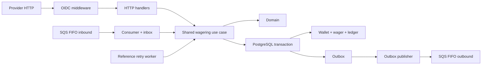

# Plano de implementação

Estado: **implementação ativa**. O plano aprovado é executado autonomamente, com decisões rotineiras registradas em `DECISIONS.md`. `SPEC.md` é a entrada autoritativa, local e imutável; seu conteúdo não será versionado nem modificado.

## Objetivo e fronteiras

Construir um serviço Go com Uber Fx, PostgreSQL, SQS local e IdP OIDC externo. HTTP e SQS compartilham o mesmo caso de uso financeiro. A transação SQL reúne registro da operação, saldo, ledger, inbox (quando houver) e outbox. Cada instância é substituível; nenhuma garantia depende de memória local ou da deduplicação FIFO.

O primeiro corte funcional deve permitir abrir uma carteira, consultar saldo e ledger, processar BET/WIN/LOSS/REFUND/ROLLBACK e reproduzir resultados por chave. Os cortes seguintes acrescentam referência pendente, consumidor, publicador, segurança, observabilidade e testes de falha. A entrega só é considerada completa com testes reais e documentação reproduzível.

## Arquitetura proposta

- **Domínio:** `Money` em `int64` de centavos e código de moeda, sem ponto flutuante; entidades encapsuladas com construtores distintos de reidratação; erros tipados; eventos tipados e snapshot imutável. Entradas externas têm escala decimal de duas casas; validação rejeita escala excedente, notação científica, negativos e overflow.
- **Persistência:** PostgreSQL com `pgx` e SQL explícito. `wallets` tem `UNIQUE(player_id,currency)`, saldo não negativo e versão. Cada operação bloqueia apenas sua carteira por `SELECT ... FOR UPDATE` dentro de uma transação. Constraints e índices únicos protegem chaves externas, ledger, abertura e reversões. Trigger impede `UPDATE`/`DELETE` do ledger. O ledger valida valor positivo e equação entre saldos. A versão começa em 1 na abertura e só aumenta depois dela quando o saldo muda.
- **Processamento:** HTTP executa a operação em uma transação e devolve o resultado confirmado. Referência ausente ou ainda pendente gera `PENDING_REFERENCE` durável; o worker reivindica essas operações por lease e tenta novamente. Após limite de tentativas ou TTL, registra `REJECTED` e evento. Falhas transitórias de infraestrutura não são convertidas em rejeições de negócio. Replays consultam o resultado armazenado, incluindo saldo observado originalmente.
- **Idempotência:** hash SHA-256 do JSON canônico dos campos de negócio normalizados, compartilhado por HTTP/SQS. Índices únicos para `(provider_id,idempotency_key)` e `(provider_id,external_transaction_id)` impedem reaplicação por outra chave. SQS acrescenta inbox única por `(consumer_name,message_id)` e compara seu hash; seu commit ocorre com a operação financeira. A operação síncrona sem referência não confirma um `PENDING` intermediário.
- **Reversões:** REFUND e ROLLBACK exigem referência processada e identidade financeira compatível. BET admite no máximo uma reversão bem-sucedida entre REFUND e ROLLBACK, impedindo dois créditos do mesmo débito. WIN e REFUND admitem no máximo um ROLLBACK cada. ROLLBACK de WIN/REFUND debita e pode ser rejeitado por falta de saldo com código próprio. Referência rejeitada/falha termina a espera com rejeição específica.
- **Mensageria:** fila FIFO de entrada com DLQ e acesso restrito por credenciais do broker; somente um produtor interno autorizado envia mensagens para a fila. O produtor vincula a identidade de provedor validada no IdP ao pedido antes do envio, e o consumidor valida os campos de domínio. Credenciais e política de fila serão descritas em `ARCHITECTURE.md`. Eventos saem por outbox para fila FIFO própria. Publicadores concorrentes usam `FOR UPDATE SKIP LOCKED`, lease, backoff e `eventId` estável; republicação após falha é esperada.
- **Segurança:** endpoints de negócio exigem token OIDC validado por JWKS (issuer, audience, assinatura, expiração e permissões). Claims autorizadas vinculam `providerId`; consultas por ID e replays são filtrados por provedor. Abertura de carteira, ledger e reconciliação exigem papel de serviço interno. Health checks são públicos. O acesso SQS é para o produtor interno, sem aceitar mensagens de provedores diretamente.
- **Composição:** módulos Fx para configuração, DB, OIDC, SQS, repositórios, casos de uso, HTTP e workers. `fx.Lifecycle` inicia dependências e listeners, interrompe novas entradas, cancela polls, espera operações em curso com prazo e fecha recursos depois dos usuários deles.
- **Observabilidade:** logs JSON correlacionados sem payload financeiro completo; métricas para status, duplicatas, retries, DLQ, conflitos, latência, atraso da outbox e divergências; liveness e readiness para PostgreSQL/SQS.

## Estados e contratos

`PENDING -> PROCESSED | PENDING_REFERENCE | REJECTED | FAILED`; `PENDING_REFERENCE -> PROCESSED | REJECTED | FAILED`. Estados terminais não mudam. `FAILED` só representa falha permanente de infraestrutura auditável. Erros transitórios retornam resposta de indisponibilidade ou reentrega SQS; uma operação confirmada como pendente permanece retomável. `OPENING` é apenas interno e é `PROCESSED` na criação positiva da carteira.

O contrato HTTP deve distinguir entrada inválida, conflito de idempotência, rejeição de negócio, pendência e indisponibilidade transitória. O envelope SQS inbound usa `messageId` próprio; delete só após commit. Rejeição de negócio confirmada permite delete. Mensagem inválida ou erro permanente segue política de redrive/DLQ. O cursor do ledger é opaco e ordena por `(created_at,id)`.

## Grafo de tarefas

IDs, dependências, critérios e agente/modelo/tier executáveis estão em [TASKS.yaml](TASKS.yaml). Caminho crítico: `T01/T02/T03 -> T04/T06 -> T07 -> T08/T09/T10/T11 -> T15/T16/T17 -> T19`. Os ramos de infraestrutura e autenticação entram antes dos testes reais.

Paralelização em execução com workers Orca supervisionados:

1. `T01`, `T02` e `T03` podem começar em paralelo em áreas separadas (combinando interfaces mínimas primeiro).
2. Após `T03`, `T04` e `T14` podem avançar enquanto `T02` é concluída. `T05` e `T12` podem trabalhar em paralelo com persistência (`T06`).
3. Após `T07`, handlers HTTP (`T08`), consumer/inbox (`T09`), referência pendente (`T10`) e outbox (`T11`) podem avançar em paralelo, com contratos compartilhados estáveis.
4. Integração financeira/mensageria (`T15`) e integração de autenticação (`T16`) podem rodar em paralelo. `T17` executa cenários de múltiplos processos depois que os fluxos completos estiverem prontos.
5. Documentação (`T18`) acompanha os contratos estáveis; auditoria final (`T19`) consolida tudo.

Para reduzir conflitos entre worktrees, cada tarefa tem dono de arquivos e deve preservar interfaces acordadas. O responsável principal integra mudanças em ordem de dependência; nenhuma tarefa paralela altera migrations ou APIs compartilhadas sem alinhar o contrato primeiro.

## Critérios de conclusão

- `docker compose up --build` inicia PostgreSQL, IdP provisionado, SQS local e serviço; filas e DLQ ficam prontas.
- `go test ./...`, `go test -race ./...` e `go vet ./...` passam; integração real tem comandos separados e reproduzíveis.
- Testes comprovam duplicidade 50x, duas BET de 80 sobre 100, carteiras independentes, HTTP/SQS cruzados, três processos, reinício, referência fora de ordem, inbox/outbox concorrentes e falhas entre commit/publicação/delete.
- Verificação final compara saldo ao ledger e valida auth de provedores, constraints SQL, invariantes monetárias, shutdown e reconciliação.
- `README.md`, `.env.example` e `ARCHITECTURE.md` registram execução, decisões, códigos de falha, contratos, limitações e comandos de recuperação.

## Riscos a validar cedo

1. Integração real do IdP, assinatura JWKS e identidades de teste, sobretudo isolamento de provedores.
2. Semântica de referência concorrente: lock da carteira e índice parcial de reversões precisam preservar uma única devolução mesmo com HTTP e SQS simultâneos.
3. Abertura com saldo inicial positivo e ledger/outbox no mesmo commit, com versão 1.
4. Redrive FIFO, visibility timeout e lease do outbox precisam tolerar processos interrompidos.
5. Testes de múltiplas instâncias devem usar processos e pools de conexões independentes, não goroutines do mesmo processo.
